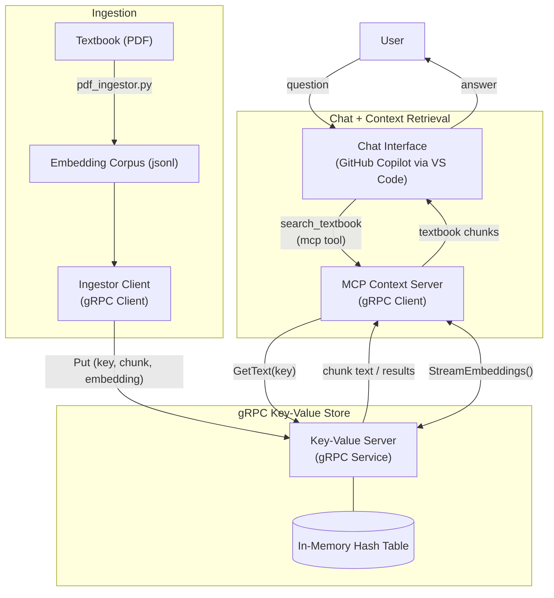
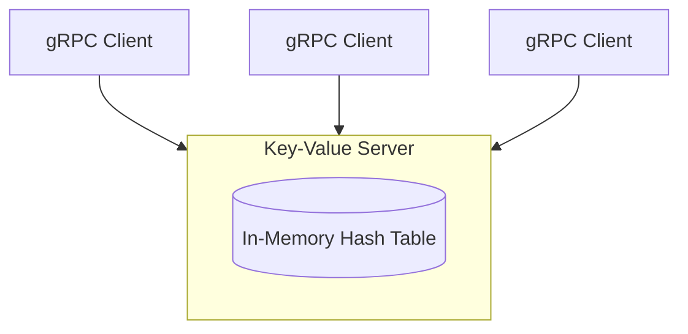
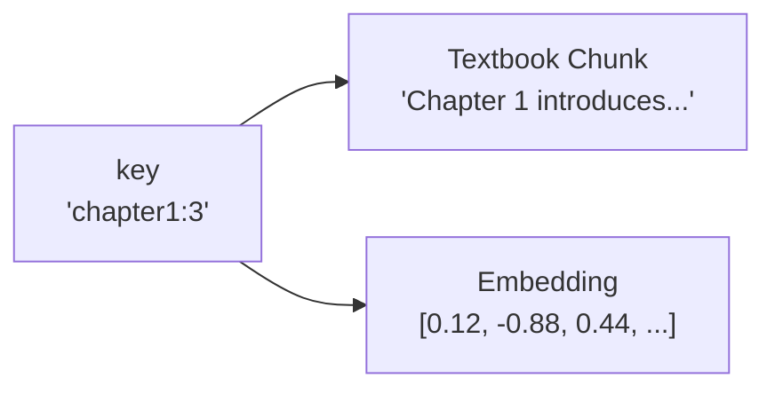

# Project 1: gRPC Key-Value Store for Context Serving

**Course:** CSCI 5105 - Introduction to Distributed Systems  
**Semester:** Spring 2026  
**Instructor:** Jon Weissman  
**Released:** 02/09/2026  
**Due:** 02/23/2026 @ 11:59 PM

---

## 1. Overview

In this project, you will implement a **single-node gRPC-based key-value store** that supports a modern *context-serving* workload similar to those used by large language model systems.

Modern LLMs are no longer used in isolation. Instead of relying solely on their internal training data, they are increasingly paired with **external context providers** that supply relevant information at query time. This approach allows models to answer domain-specific questions, work with private data, and operate over datasets far larger than their context window.

In this project, we demonstrate this idea using the course textbook as an external knowledge source. The textbook is:

1. converted into text
3. chunked into semantically meaningful segments
4. embedded into vector representations
5. stored in a gRPC-accessible key-value store

An instructor-provided **Model Context Protocol (MCP) server** retrieves this data at query time and exposes it to a chat interface such as GitHub Copilot.

Your task is to build the **storage layer** that makes this possible.


---

## 2. Motivation and System Context

Large language models have largely plateaued in terms of performance gains achieved purely through larger training runs. As a result, many recent innovations focus on **augmenting models at inference time** rather than retraining them.

One dominant approach is **retrieval-augmented generation (RAG)**, where a model dynamically retrieves relevant information from external systems and incorporates it into its response. This requires infrastructure that can:

- store large corpora efficiently
- retrieve small, relevant subsets quickly
- integrate cleanly with model-facing services

To standardize this interaction, many systems now expose external knowledge through a **Model Context Protocol (MCP)**. An MCP server acts as a bridge between a model-facing chat interface and one or more backend data sources.

In this project:
- GitHub Copilot represents the **chat interface**
- an instructor-provided MCP server represents the **context provider**
- your gRPC key-value store represents the **backend storage system**

The MCP server does not store data itself. Instead, it exposes **tools** that retrieve data from your key-value store on demand for the model-facing chat interface.


---

## 3. High-Level Architecture

The following diagram shows the larger system your key-value store fits into.



The following diagram shows how the components interact at a high level.

- The **PDF Vectorizer** converts the textbook into text chunks and embeddings and ingests them into the key-value store.
- The **Key-Value Store** holds textbook chunks and their corresponding embedding vectors in memory.
- The **MCP Context Server** exposes tools that retrieve data from the key-value store.
- The **Chat Interface** invokes MCP tools when it needs additional context to answer a user question.

The language model never sees the full textbook. It only receives small, retrieved pieces of text selected by the MCP server.


---

## 4. Project 1 Scope

For Project 1, your system consists of a **single key-value server** accessed by multiple concurrent clients. 

> [!NOTE]
> For project 1 typically only a single client will be accessing the gRPC client at once.



All data is stored:

* in memory
* on a single server
* without replication

This allows you to focus on correctness and concurrency before introducing distributed state.

---

## 5. Data Model

Your key-value store maintains **two logical mappings**, both indexed by the same string key:

- `key -> textbook chunk (string)`
- `key -> embedding vector (opaque bytes)`

Keys are strings derived from document identifiers and chunk indices, for example:

`"textbook_distributed_systems_v3.03:16"`


Values are treated as **opaque** by the server:
- textbook chunks are stored as strings
- embeddings are stored as raw byte arrays

The server does not interpret embeddings or perform vector operations. It simply stores and returns bytes.




---

## 6. gRPC Interface

Only a subset of the `.proto` file will be provided. The `Put` and `StreamEmbeddings` RPCs are given as reference examples.

You are responsible for:

* Completing the `.proto` file
* Defining request and response message types
* Implementing the remaining RPCs in the server

Your implementation must be compatible with the provided client and MCP server.

---

### KeyValueStore Service

#### Put (_provided_)

**Unary RPC**

Stores or overwrites the textbook chunk and embedding associated with a key.

**Request: `PutRequest`**

| Field          | Type   | Description                 |
| -------------- | ------ | --------------------------- |
| key            | string | Unique identifier           |
| textbook_chunk | string | Text content                |
| embedding      | bytes  | Serialized embedding vector |

**Response: `PutResponse`**

| Field       | Type | Description                            |
| ----------- | ---- | -------------------------------------- |
| overwritten | bool | True if an existing entry was replaced |

---

#### GetText

**Unary RPC**

Retrieves the textbook chunk text associated with a key, if it exists.

**Request: `GetTextRequest`**

| Field | Type   | Description |
| ----- | ------ | ----------- |
| key   | string | Lookup key  |

**Response: `GetTextResponse`**

| Field          | Type   | Description            |
| -------------- | ------ | ---------------------- |
| found          | bool   | Whether the key exists |
| textbook_chunk | string | Stored text if found   |

---

#### Delete

**Unary RPC**

Removes all data associated with a key from the store.

**Request: `DeleteRequest`**

| Field | Type   | Description   |
| ----- | ------ | ------------- |
| key   | string | Key to delete |

**Response: `DeleteResponse`**

| Field   | Type | Description                  |
| ------- | ---- | ---------------------------- |
| deleted | bool | True if an entry was removed |

---

#### List

**Unary RPC**

Returns all keys currently stored in the key-value store.

**Request: `ListRequest`**
No fields.

**Response: `ListResponse`**

| Field | Type            | Description     |
| ----- | --------------- | --------------- |
| keys  | repeated string | All stored keys |

---

#### Health

**Unary RPC**

Reports basic server metadata and current store size.

**Request: `HealthRequest`**
No fields.

**Response: `HealthResponse`**

| Field          | Type   | Description                |
| -------------- | ------ | -------------------------- |
| server_name    | string | Human-readable server name |
| server_version | string | Version identifier         |
| key_count      | uint64 | Number of stored keys      |

---

#### StreamEmbeddings (_provided_)

**Server-streaming RPC**

Streams all stored embedding vectors and their associated keys.

**Request: `StreamEmbeddingsRequest`**
No fields.

**Response stream: `EmbeddingEntry`**

| Field     | Type   | Description                 |
| --------- | ------ | --------------------------- |
| key       | string | Entry key                   |
| embedding | bytes  | Serialized embedding vector |

---

## 7. What Is Provided vs What You Must Implement

### Provided

The following components are fully provided and must not be modified except where explicitly noted:

* PDF vectorization pipeline
* ingestion client that feeds data into the key-value store
* most of the MCP server implementation
* server base code that already implements:

  * `Put`
  * `StreamEmbeddings`

### You Must Implement

You are responsible for:

1. Completing the gRPC interface in `kvstore.proto`
2. Implementing all missing RPC handlers in the key-value server
3. Implementing **`get_text_from_keys`** in `mcp_server.py`

   * this function retrieves textbook chunks from your key-value store given a list of keys

Your implementation must work correctly with the provided ingestion client and MCP server without modification.

---

## 8. How the System Is Used

At runtime:

1. The ingestion client streams textbook chunks and embeddings into your key-value store.
2. The MCP server retrieves all embeddings using `StreamEmbeddings` and builds an in-memory index.
3. When a user asks a question, the MCP server:

   * finds the most relevant embeddings locally
   * retrieves the corresponding text using `GetText`
   * returns the text to the chat interface as context

Your server is not responsible for ranking, similarity computation, or query understanding.

---

## 9. Repository Layout

The repository is organized to separate **storage**, **ingestion**, and **context-serving** concerns. You will primarily work inside the gRPC key-value store and a small portion of the MCP server.

```text
.
├── .devcontainer/
│   └── devcontainer.json
│       Development container configuration used for all projects
│
├── .vscode/
│   └── mcp.json
│       VS Code configuration for MCP tool integration
│
├── gRPC_KVS/
│   ├── proto/
│   │   └── kvstore.proto
│   │       gRPC interface definition (YOU will complete this)
│   │
│   ├── scripts/
│   │   └── gen_proto.sh
│   │       Script to regenerate gRPC bindings after editing the proto file
│   │
│   └── src/
│       Generated gRPC source files (auto-generated, do not edit manually)
│
├── ingestion/
│   ├── RAG/
│   │   └── output/
│   │       Vectorized textbook chunks (jsonl files produced offline)
│   │
│   └── ingestion_client.py
│       Client that reads vectorized chunks and ingests them into the KVS
│
├── mcp_server/
│   └── mcp_server.py
│       MCP server implementation
│       YOU must implement get_text_from_keys in this file
│
├── server/
│   ├── server.py
│   │   gRPC key-value store server
│   │   Base code is provided, YOU implement missing RPC logic
│   │
│   └── kvstore.pkl
│       On-disk persistence file for the in-memory key-value store
|       (created after server is closed)
│
├── README.md
│   Project description and student instructions
│
└── requirements.txt
    Python dependencies for the project
```

### Where You Will Work

* **Primary work**

  * `gRPC_KVS/proto/kvstore.proto`
  * `server/server.py`
  * `mcp_server/mcp_server.py` (only `get_text_from_keys`)

* **Use caution when modifying**

  * Ingestion pipeline
  * Ingestion client
  * Generated gRPC code
  * MCP server logic outside the required function

This separation mirrors real-world systems, where storage, ingestion, and model-facing services are developed and owned independently.

---

## 10. Running the System

We will record a video walkthrough demonstrating execution. The steps below are intentionally high level.

Typical workflow:

1. **Edit the gRPC interface:**

   * `gRPC_KVS/proto/kvstore.proto`

2. **Regenerate gRPC bindings:**

   * `gRPC_KVS/scripts/gen_proto.sh`

3. **Modify the gRPC server based on updates to `.proto` above:**

   * `server/server.py`

4. **Start the key-value server:**

```bash
cd /workspaces/project_1/server
python server.py
```

5. **Run the ingestion client to populate the store:**

```bash
cd /workspaces/project_1/ingestion
python ingestion_client.py
```

6. **Start the MCP server**

   * Open `/workspaces/project_1/.vscode/mcp.json` in VS Code
   * Click `start` which should be located just above our pre-defined MCP server `csci5105-rag-poc`

Exact commands and environment details will be shown in a demonstration video.

---

## 11. Testing

You must develop your own tests, including:

* basic functionality tests
* concurrent access tests
* negative tests for missing keys and invalid inputs

Your README must explain how to:

* start your server
* run your tests
* interpret expected outputs

---

## 12. Deliverables

Submit a single `.zip` containing:

* source code
* completed `.proto` file
* `README.md`
* design document (markdown format preferred)

Do not include:

* compiled binaries
* IDE configuration files
* unnecessary dependencies

---

## 13. Grading

> [!NOTE]
> Tentative grading breakdown subject to change once grading begins

| Component                       | Weight |
| ------------------------------- | ------ |
| Functionality and correctness   | 70%    |
| Concurrency and synchronization | 15%    |
| Documentation and design        | 10%    |
| Code quality and style          | 5%     |

---

## Appendix A: Development Tips

* Start simple, then add concurrency
* Protect shared state carefully
* Keep your gRPC handlers small and clear


## Appendix B: Text Vectorization (Optional Background)

Textbook chunks are converted into fixed-length numeric vectors using a sentence embedding model. These vectors capture semantic similarity between chunks of text.

You do not need to understand how embeddings are computed to complete this project.

For Project 1:
- embeddings are provided in advance
- your server stores embeddings as opaque bytes
- no vector math is performed inside the key-value store

Vector indexing and similarity search are handled entirely by the MCP server.

